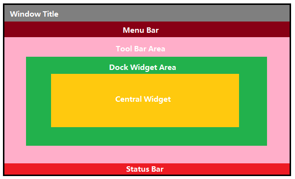

# Notes of Qt Learning


## 信号槽

`所有类必须继承QObject之后才能有信号槽的能力`

`凡是继承自QObject的类，都应该在类定义的第一行写上Q_OBJECT，以此宏来展开提供信号槽/国际化等机制`


### connect函数

```c++
QMetaObject::Connection connect(const QObject *, const char *,
                                const QObject *, const char *,
                                Qt::ConnectionType);

QMetaObject::Connection connect(const QObject *, const QMetaMethod &,
                                const QObject *, const QMetaMethod &,
                                Qt::ConnectionType);

QMetaObject::Connection connect(const QObject *, const char *,
                                const char *,
                                Qt::ConnectionType) const;

QMetaObject::Connection connect(const QObject *, PointerToMemberFunction,
                                const QObject *, PointerToMemberFunction,
                                Qt::ConnectionType)

QMetaObject::Connection connect(const QObject *, PointerToMemberFunction,
                                Functor);
```

[Qt学习之路2 信号槽](https://www.devbean.net/2012/08/qt-study-road-2-signal-slot/ "https://www.devbean.net/2012/08/qt-study-road-2-signal-slot/")


### 信号定义

信号在类的`声明中实现`，除了常规的**private**和**public**之外，需要定义一个类型为**signal**的。

类似如下的代码：

```cpp
signals:
    void newPaper(const QString &name);
```

其中信号就是函数名，参数是该类需要让外界知道的数据。

信号不需要在cpp文件中添加任何实现。


### send()

定义类似如下：

```cpp
    void send()
    {
        emit newPaper(m_name);
    }
```

其中`emit`为Qt的关键字，含义是发出newPaper信号，感兴趣的接收者会关注这个信号。

同时参数为随信号传递出的信息，供接收者参考。


### 接收者

`在Qt5中，任何成员函数/static函数/全局函数/Lambda表达式，都可以作为槽函数`

作为例子，给出一个实现：

```cpp
    void receiveNewspaper(const QString & name) // 称为槽函数
    {
        qDebug() << "Receives Newspaper: " << name;
    }
```


### 构造连接

这里给出一个使用`connect()`函数来构造信号槽连接的方式：

```cpp
Newspaper newspaper("Newspaper A"); // 发出信号的类
Reader reader; // 接收并响应信号的类
QObject::connect(&newspaper, &Newspaper::newPaper,
                     &reader,    &Reader::receiveNewspaper);
```


### 发出信号

```cpp
newspaper.send();
```

使用如上调用就可以触发一次信号。


## Qt 模块简介

[Qt学习之路2 Qt模块简介](https://www.devbean.net/2012/08/qt-study-road-2-modules/ "https://www.devbean.net/2012/08/qt-study-road-2-modules/")


## MainWindow 主窗口

`含义与MFC的MainWindow保持一致 ，是应用最外的窗体`

### 窗口划分



如上图所示，MainWindow被分割为如上几个部分，可以进行分别的操作。

Central Widget是窗口中的工作区。


[Qt学习之路2 MainWindow简介](https://www.devbean.net/2012/08/qt-study-road-2-mainwindow/ "https://www.devbean.net/2012/08/qt-study-road-2-mainwindow/")


## Action 动作

### 介绍

Qt中使用`Action`类来定义动作，这个类就代表了窗口的一个**动作**。

这个动作可能显示在菜单中，作为一个菜单项；也可能在工具栏，作为一个工具栏项。二无论是在哪里，用户点击之后执行的反应都是一样的。（也正因如此，Qt没有设置专门的菜单项类或者工具栏项类）


### QAction

定义的例子如下

```cpp
#include <QMainWindow>

class MainWindow : public QMainWindow
{
    Q_OBJECT
public:
    MainWindow(QWidget *parent = 0);
    ~MainWindow();

private:
    void open();

    QAction *openAction;
};
```

```cpp
MainWindow::MainWindow(QWidget *parent) :
    QMainWindow(parent)
{
    setWindowTitle(tr("RPG Window"));

    openAction = new QAction(QIcon(":/images/doc-open"), tr("&Open..."), this);
    // tr中的“&”代表了快捷键
    openAction->setShortcuts(QKeySequence::Open);
    openAction->setStatusTip(tr("Open an existing file"));
    connect(openAction, &QAction::triggered, this, &MainWindow::open);

    QMenu *file = menuBar()->addMenu(tr("&File"));
    file->addAction(openAction);

    QToolBar *toolBar = addToolBar(tr("&File"));
    toolBar->addAction(openAction);
    // 使用如上两段，可以增加action到目录或者工具栏。

    statusBar() ;
}

MainWindow::~MainWindow()
{
}

void MainWindow::open()
{
    QMessageBox::information(this, tr("Information"), tr("Open"));
}
```

#### QAction.setShortcut()

用于设置动作的快捷键，其中可以使用`QKeySequence()`，可以避免不同物理机上的键盘不一致而导致的快捷键不可用，是通用化的函数。

#### QAction.setStatusTip()

当用户鼠标滑过图标的时候，在下方status显示的相应提示。

#### QAction.triggered()

触发信号，用于连接信号槽。

在connect中写作**&QAction::triggered**


[Qt学习之路2 添加动作](https://www.devbean.net/2012/08/qt-study-road-2-action/ "https://www.devbean.net/2012/08/qt-study-road-2-action/")


## 资源文件

[Qt学习之路2 资源文件](https://www.devbean.net/2012/08/qt-study-road-2-resource-files/ "https://www.devbean.net/2012/08/qt-study-road-2-resource-files/")


## 对象模型

### QObject

**QObject**就是Qt中的对象类型。

当你创建一个QObject的时候，会接收一个QObject指针作为参数，其实作用是作为一个父对象。

`在Qt中，父对象消亡之后，其所有的子对象也都会消亡`

可以使用QObject::dumpObjectTree()和QObject::dumpObjectInfo()进行这方面的调试。


### QWidget

**QWidget**是Qt中所有能够显示的组件的父类，继承自QObject。


### 注意

1. 最好在创建一个对象的时候就指定其`parent`对象。
2. 放心大胆在堆上创建对象（new）。


[Qt学习之路2 对象模型](https://www.devbean.net/2012/09/qt-study-road-2-objects-model/ "https://www.devbean.net/2012/09/qt-study-road-2-objects-model/")


## 布局管理器

[Qt学习之路2 布局管理器](https://www.devbean.net/2012/09/qt-study-road-2-layout/ "https://www.devbean.net/2012/09/qt-study-road-2-layout/")


## 对话框

[Qt学习之路2 对话框简介](https://www.devbean.net/2012/09/qt-study-road-2-dialogs-intro/ "https://www.devbean.net/2012/09/qt-study-road-2-dialogs-intro/")

